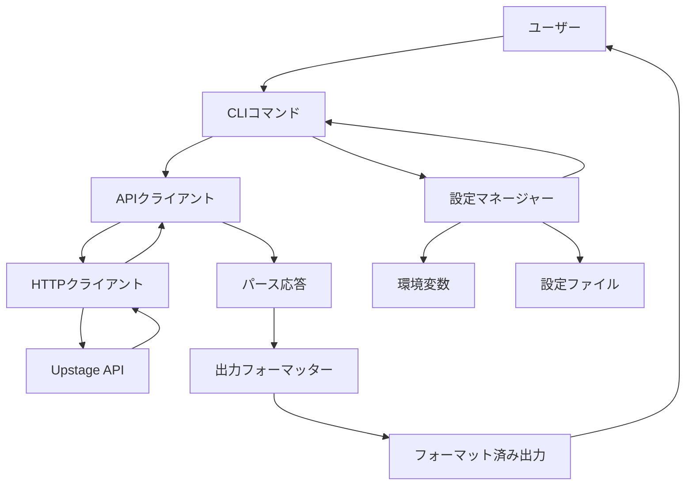
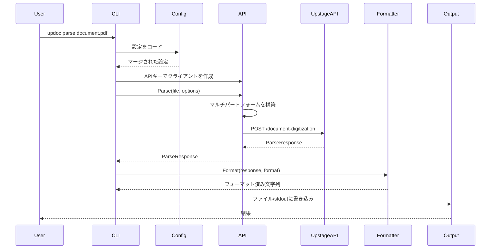
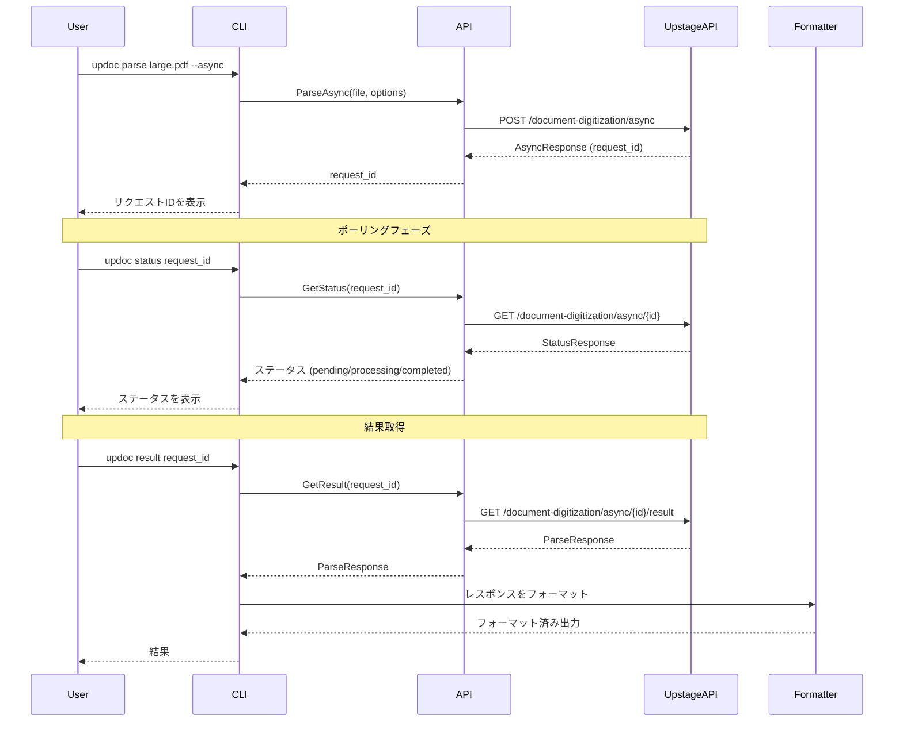
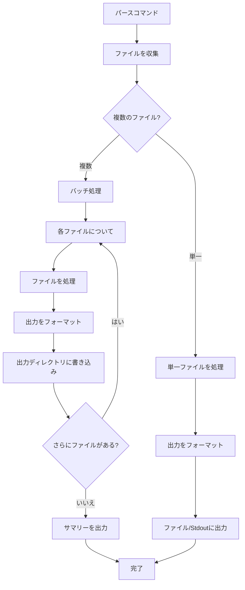
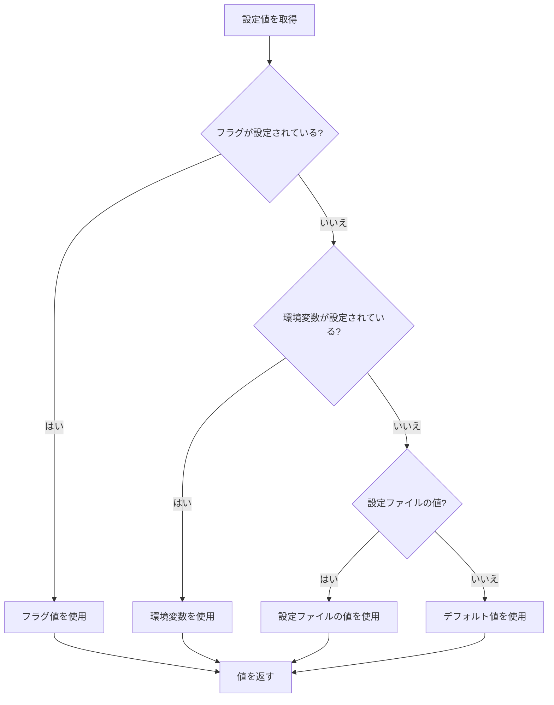
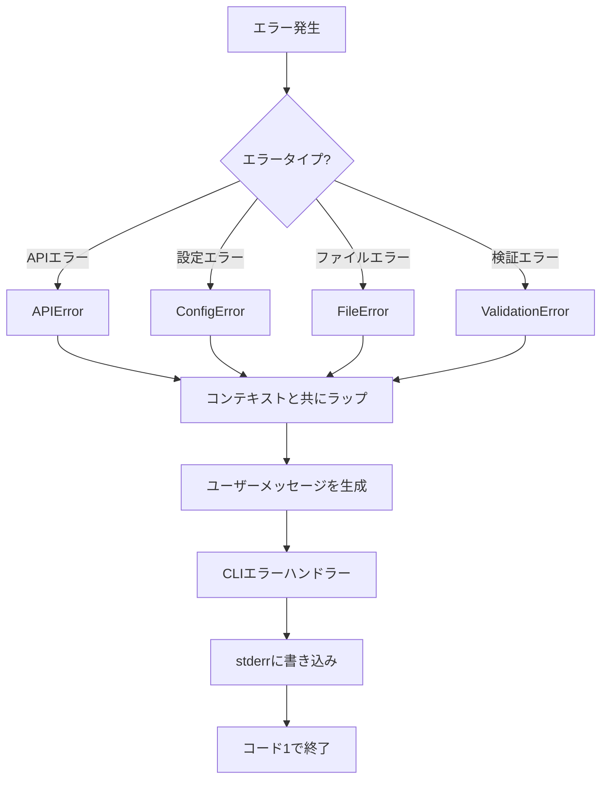

# アーキテクチャドキュメント

[English](ARCHITECTURE.md) | [한국어](ARCHITECTURE.ko.md)

このドキュメントは、`updoc` CLIツールの全体的なアーキテクチャ、設計決定、コンポーネント間の相互作用を説明します。

## 目次

- [システム概要](#システム概要)
- [パッケージ構造](#パッケージ構造)
- [データフロー](#データフロー)
- [設定階層](#設定階層)
- [エラーハンドリング戦略](#エラーハンドリング戦略)
- [拡張ポイント](#拡張ポイント)

## システム概要

`updoc`は、Upstage Document Parse APIのコマンドラインインターフェースです。同期および非同期のAPI呼び出しを通じて、ドキュメント（PDF、Officeファイル、画像）を構造化されたテキスト形式（HTML、Markdown、Text）に変換する簡単な方法を提供します。

### 高レベルアーキテクチャ



### コンポーネントの責任

| コンポーネント | 責任 |
|---------------|------|
| **CLIコマンド** (`internal/cmd`) | ユーザー入力のパース、引数の検証、ワークフローの調整 |
| **APIクライアント** (`internal/api`) | Upstage APIとのHTTP通信の処理、リクエスト/レスポンスのライフサイクル管理 |
| **設定マネージャー** (`internal/config`) | 複数のソース（環境変数、設定ファイル、CLIフラグ）から設定をロードおよびマージ |
| **出力フォーマッター** (`internal/output`) | APIレスポンスをユーザー要求形式（HTML、Markdown、Text、JSON）に変換 |
| **エントリーポイント** (`cmd/updoc`) | CLIフレームワークの初期化とアプリケーションのライフサイクル処理 |

## パッケージ構造

```
updoc/
├── cmd/updoc/              # アプリケーションエントリーポイント
│   └── main.go            # CLIの初期化とエラー処理
│
├── internal/
│   ├── api/               # Upstage APIクライアント
│   │   ├── client.go      # HTTPクライアントの実装
│   │   └── types.go       # APIリクエスト/レスポンスタイプ
│   │
│   ├── cmd/               # CLIコマンドの実装
│   │   ├── root.go        # ルートコマンドと共有ユーティリティ
│   │   ├── parse.go       # パースコマンド（同期/非同期）
│   │   ├── status.go      # ステータス確認コマンド
│   │   ├── result.go      # 結果取得コマンド
│   │   ├── config.go      # 設定管理コマンド
│   │   ├── models.go      # モデル一覧コマンド
│   │   └── version.go     # バージョンコマンド
│   │
│   ├── config/            # 設定管理
│   │   └── config.go      # 設定のロード、保存、検証
│   │
│   └── output/            # 出力フォーマット
│       └── formatter.go   # フォーマットコンバーター（HTML、Markdown、Text、JSON）
│
├── test/                  # テストファイル
│   ├── e2e/              # エンドツーエンドテスト
│   └── testdata/         # テストフィクスチャ
│
└── docs/                  # ドキュメント
    ├── ARCHITECTURE.md   # このファイル
    └── CLI_MANUAL.md     # CLIリファレンス
```

### パッケージの詳細

#### `cmd/updoc`
- **目的**: アプリケーションエントリーポイント
- **責任**: Cobra CLIフレームワークの初期化、トップレベルのエラー処理
- **依存関係**: `internal/cmd`

#### `internal/api`
- **目的**: Upstage APIクライアントの抽象化
- **責任**:
  - HTTPリクエストの構築（ファイルアップロード用のマルチパートフォームデータ）
  - API認証の処理（Bearerトークン）
  - APIレスポンスとエラーのパース
  - 同期および非同期操作のサポート
- **主要タイプ**: `Client`, `ParseRequest`, `ParseResponse`, `AsyncResponse`, `StatusResponse`

#### `internal/cmd`
- **目的**: CLIコマンドの実装
- **責任**:
  - コマンド構造とフラグの定義
  - ユーザー入力の検証
  - APIクライアント、設定、出力フォーマッター間の調整
  - バッチ処理の処理
  - 非同期ワークフローの管理（パース → ステータス → 結果）
- **主要コマンド**: `parse`, `status`, `result`, `config`, `models`, `version`

#### `internal/config`
- **目的**: 設定管理
- **責任**:
  - YAMLファイルから設定をロード
  - 環境変数から設定をマージ
  - 設定階層の解決を提供
  - 設定値の検証
  - 設定ファイルへの保存
- **主要タイプ**: `Config`

#### `internal/output`
- **目的**: 出力フォーマット
- **責任**:
  - APIレスポンスを要求された形式に変換
  - 複数の出力形式をサポート（HTML、Markdown、Text、JSON）
  - 要素のみの出力モードの処理
- **主要タイプ**: `Formatter`インターフェース、`HTMLFormatter`, `MarkdownFormatter`, `TextFormatter`, `JSONFormatter`

## データフロー

### 同期リクエストのライフサイクル



### 非同期リクエストのライフサイクル



### バッチ処理のフロー



## 設定階層

設定値は次の順序で解決されます（優先度: 高 → 低）：

1. **コマンドラインフラグ** - 直接ユーザー入力
2. **環境変数** - システムレベルの設定
3. **設定ファイル** - ユーザー固有のデフォルト
4. **デフォルト値** - 組み込みデフォルト

### 設定解決フロー



### 設定ソース

#### 環境変数
- `UPSTAGE_API_KEY` - API認証キー
- `UPSTAGE_API_ENDPOINT` - カスタムAPIエンドポイント（プライベートホスティング用）
- `UPDOC_CONFIG_PATH` - デフォルト設定ファイルパスをオーバーライド
- `UPDOC_LOG_LEVEL` - ログレベル

#### 設定ファイル (Linux/macOS: `~/.config/updoc/config.yaml`, Windows: `%APPDATA%\updoc\config.yaml`)
```yaml
api_key: "up_xxxxxxxxxxxx"
endpoint: "https://api.upstage.ai/v1"
default_format: "markdown"
default_mode: "standard"
default_ocr: "auto"
output_dir: ""
```

#### コマンドラインフラグ
- `--api-key` - APIキーをオーバーライド
- `--endpoint` - APIエンドポイントをオーバーライド
- `--format` - 出力形式をオーバーライド
- `--mode` - パースモードをオーバーライド
- `--ocr` - OCR設定をオーバーライド

#### デフォルト値
- 形式: `markdown`
- モード: `standard`
- OCR: `auto`
- エンドポイント: `https://api.upstage.ai/v1`

## エラーハンドリング戦略

### エラータイプ

#### 1. APIエラー (`internal/api`)
- **タイプ**: `APIError`
- **プロパティ**: StatusCode, Message, Type, Code
- **処理**: コンテキストと共にラップして呼び出し元に返す
- **ユーザーメッセージ**: ステータスコードを含む明確なエラーメッセージ

```go
type APIError struct {
    StatusCode int
    Message    string
    Type       string
    Code       string
}
```

#### 2. 設定エラー (`internal/config`)
- **タイプ**: `ErrUnknownKey`, `ErrInvalidFormat`, `ErrInvalidMode`, `ErrInvalidOCR`
- **処理**: 説明的なエラーメッセージと共に即座に返す
- **ユーザーメッセージ**: 特定の検証エラー

#### 3. ファイルシステムエラー (`internal/cmd`)
- **タイプ**: 標準Goエラー (`os.PathError`, `os.ErrNotExist`)
- **処理**: 操作のコンテキストと共にラップ
- **ユーザーメッセージ**: ファイルパスと操作コンテキスト

#### 4. 検証エラー (`internal/cmd`)
- **タイプ**: カスタムエラーメッセージ
- **処理**: API呼び出し前に返す
- **ユーザーメッセージ**: 問題点と修正方法に関する明確なガイダンス

### エラーハンドリングパターン

#### パターン1: 早期検証
```go
// 処理前に検証
if apiKey == "" {
    return fmt.Errorf("API key not set. Set it with 'updoc config set api-key <your-key>'")
}
```

#### パターン2: エラーラッピング
```go
// コンテキストと共にエラーをラップ
if err != nil {
    return fmt.Errorf("parse failed: %w", err)
}
```

#### パターン3: ユーザーフレンドリーなメッセージ
```go
// 技術的エラーをユーザーフレンドリーなメッセージに変換
if apiErr, ok := err.(*api.APIError); ok {
    return fmt.Errorf("API error: %s", apiErr.Message)
}
```

### エラーフロー



## 拡張ポイント

### 新しい出力形式の追加

新しい出力形式を追加するには：

1. **`internal/output/formatter.go`で`Formatter`インターフェースを実装**:
```go
type CustomFormatter struct{}

func (f *CustomFormatter) Format(resp *api.ParseResponse) (string, error) {
    // respをカスタム形式に変換
    return formattedString, nil
}
```

2. **`NewFormatter`関数に登録**:
```go
func NewFormatter(format string) (Formatter, error) {
    switch format {
    // ... 既存のケース
    case "custom":
        return &CustomFormatter{}, nil
    }
}
```

3. **`internal/config/config.go`で形式検証を追加**:
```go
ValidFormats = []string{"html", "markdown", "text", "custom"}
```

4. **`internal/cmd/parse.go`でCLIヘルプテキストを更新**:
```go
parseCmd.Flags().StringP("format", "f", "", "output format: html, markdown, text, custom")
```

### 新しいコマンドの追加

新しいコマンドを追加するには：

1. **`internal/cmd/`にコマンドファイルを作成**:
```go
package cmd

import "github.com/spf13/cobra"

var newCmd = &cobra.Command{
    Use:   "new <args>",
    Short: "コマンドの説明",
    Long:  "詳細な説明",
    RunE:  runNew,
}

func init() {
    newCmd.Flags().StringP("flag", "f", "", "フラグの説明")
    rootCmd.AddCommand(newCmd)
}

func runNew(cmd *cobra.Command, args []string) error {
    // コマンドの実装
    return nil
}
```

2. **新しいファイルの`init()`関数でコマンドを登録**

3. **ドキュメントを更新**:
   - `docs/CLI_MANUAL.md`に追加
   - `README.md`のコマンドサマリーを更新

### 新しい設定オプションの追加

新しい設定オプションを追加するには：

1. **`internal/config/config.go`の`Config`構造体にフィールドを追加**:
```go
type Config struct {
    // ... 既存のフィールド
    NewOption string `yaml:"new_option"`
}
```

2. **デフォルト値を追加**:
```go
const DefaultNewOption = "default_value"
```

3. **`Set`および`Get`メソッドを更新**:
```go
func (c *Config) Set(key, value string) error {
    switch key {
    // ... 既存のケース
    case "new-option":
        c.NewOption = value
    }
}

func (c *Config) Get(key string) (string, error) {
    switch key {
    // ... 既存のケース
    case "new-option":
        return c.NewOption, nil
    }
}
```

4. **`New`および`Reset`メソッドを更新して新しいフィールドを含める**

5. **必要に応じて`internal/cmd/root.go`またはコマンド固有のファイルにCLIフラグを追加**

6. **`docs/CLI_MANUAL.md`でドキュメントを更新**

### APIクライアントの拡張

新しいAPIエンドポイントを追加するには：

1. **`internal/api/types.go`にリクエスト/レスポンスタイプを追加**:
```go
type NewRequest struct {
    // リクエストフィールド
}

type NewResponse struct {
    // レスポンスフィールド
}
```

2. **`internal/api/client.go`にクライアントメソッドを追加**:
```go
func (c *Client) NewOperation(ctx context.Context, req *NewRequest) (*NewResponse, error) {
    // リクエストを構築
    // HTTPリクエストを送信
    // レスポンスをパース
    // 結果を返す
}
```

3. **必要に応じてコマンドで使用**

## 設計決定

### CLIにCobraを使用する理由？
- Go CLIアプリケーションの業界標準
- 優れたフラグパースと検証
- 組み込みヘルプ生成
- 簡単なコマンド構成

### 別のAPIクライアントパッケージを使用する理由？
- 関心の分離
- テストの容易性（APIクライアントをモック可能）
- APIクライアントが他の場所で必要な場合の再利用性
- 明確なAPI境界

### 設定階層を使用する理由？
- 柔軟性: ユーザーが異なるレベルでデフォルトをオーバーライド可能
- セキュリティ: 機密値（APIキー）は環境変数から取得可能
- 利便性: 一般的な設定を設定ファイルに保存可能
- 予測可能性: 明確な優先順位ルール

### Formatterインターフェースを使用する理由？
- 新しい出力形式の追加が容易
- テスト可能（フォーマッターを独立してテスト可能）
- Open/Closed原則に準拠
- APIレスポンスと出力形式の明確な分離

## テスト戦略

### 単体テスト
- 各パッケージに対応する`*_test.go`ファイル
- 個々のコンポーネントを分離してテスト
- 外部依存関係をモック（HTTPクライアント、ファイルシステム）

### 統合テスト
- コンポーネント間の相互作用をテスト
- `test/testdata/`のテストフィクスチャを使用

### エンドツーエンドテスト
- `test/e2e/`に配置
- 有効なAPIキーが必要
- CLIからAPIまでの完全なワークフローをテスト

## 今後の考慮事項

- **プラグインシステム**: プラグインを通じた外部フォーマッターの許可
- **ストリーミング出力**: 大規模ドキュメントのストリーミングサポート
- **リトライロジック**: 一時的なAPIエラーに対する自動リトライ
- **レート制限**: API呼び出しに対するクライアント側のレート制限
- **キャッシング**: 繰り返しリクエストに対するAPIレスポンスのキャッシング
- **進捗インジケーター**: バッチ操作に対するより良い進捗レポート
