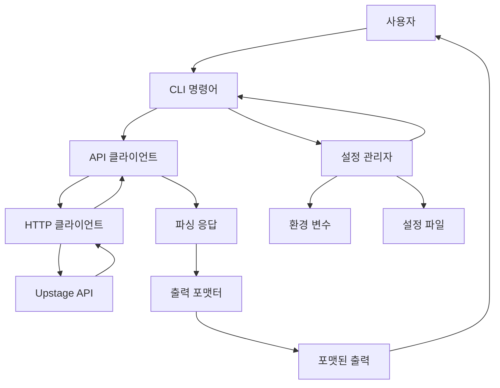
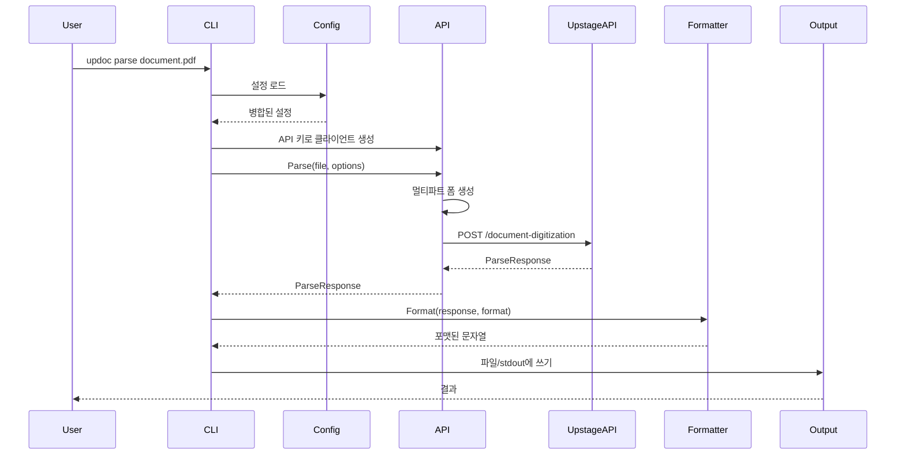
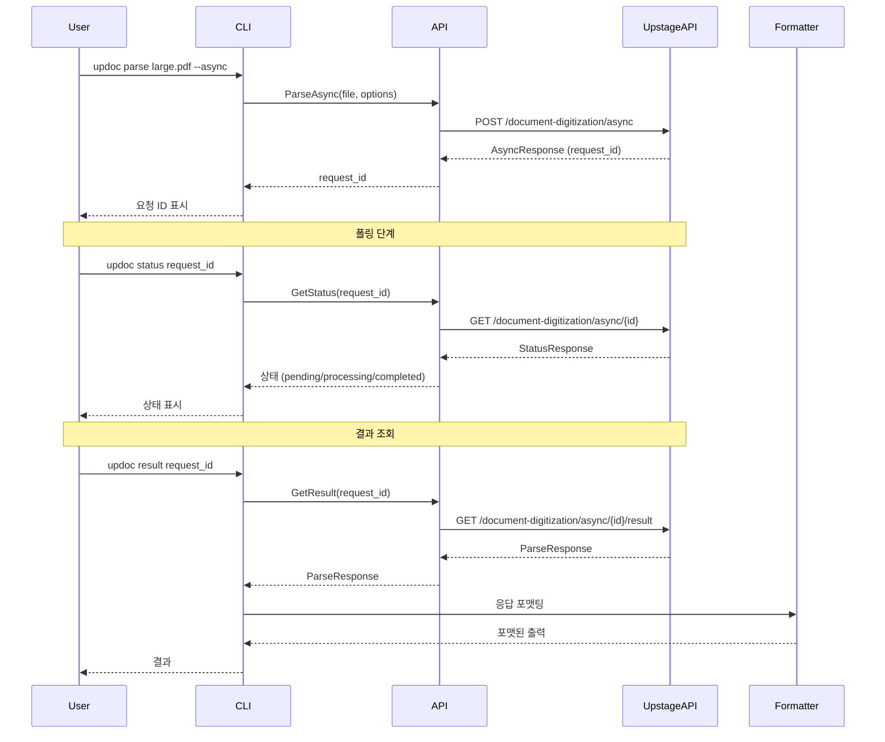
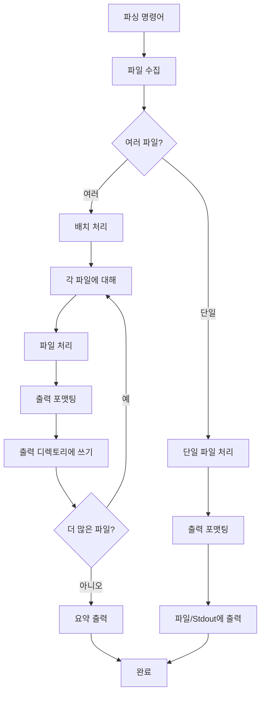
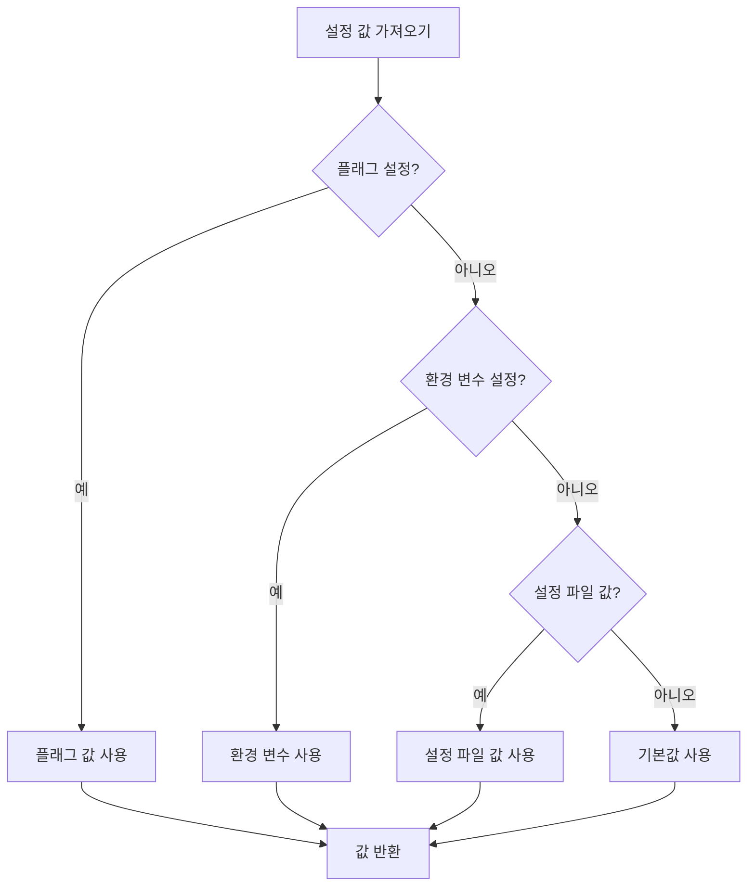
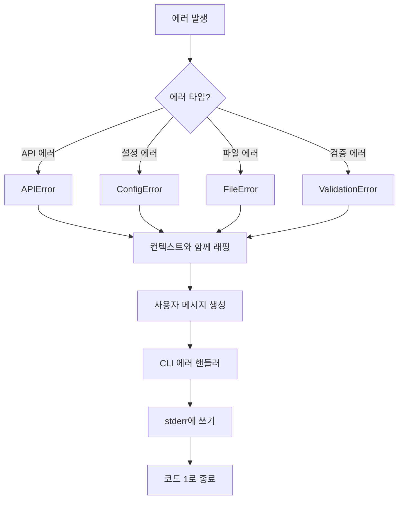

# 아키텍처 문서

[English](ARCHITECTURE.md) | [日本語](ARCHITECTURE.ja.md)

이 문서는 `updoc` CLI 도구의 전체 아키텍처, 설계 결정사항, 컴포넌트 상호작용을 설명합니다.

## 목차

- [시스템 개요](#시스템-개요)
- [패키지 구조](#패키지-구조)
- [데이터 흐름](#데이터-흐름)
- [설정 계층 구조](#설정-계층-구조)
- [에러 처리 전략](#에러-처리-전략)
- [확장 포인트](#확장-포인트)

## 시스템 개요

`updoc`은 Upstage Document Parse API를 위한 명령줄 인터페이스입니다. 동기 및 비동기 API 호출을 통해 문서(PDF, Office 파일, 이미지)를 구조화된 텍스트 형식(HTML, Markdown, Text)으로 변환하는 간단한 방법을 제공합니다.

### 고수준 아키텍처



### 컴포넌트 책임

| 컴포넌트 | 책임 |
|----------|------|
| **CLI 명령어** (`internal/cmd`) | 사용자 입력 파싱, 인자 검증, 워크플로우 조율 |
| **API 클라이언트** (`internal/api`) | Upstage API와의 HTTP 통신 처리, 요청/응답 생명주기 관리 |
| **설정 관리자** (`internal/config`) | 여러 소스(환경 변수, 설정 파일, CLI 플래그)에서 설정 로드 및 병합 |
| **출력 포맷터** (`internal/output`) | API 응답을 사용자 요청 형식(HTML, Markdown, Text, JSON)으로 변환 |
| **진입점** (`cmd/updoc`) | CLI 프레임워크 초기화 및 애플리케이션 생명주기 처리 |

## 패키지 구조

```
updoc/
├── cmd/updoc/              # 애플리케이션 진입점
│   └── main.go            # CLI 초기화 및 에러 처리
│
├── internal/
│   ├── api/               # Upstage API 클라이언트
│   │   ├── client.go      # HTTP 클라이언트 구현
│   │   └── types.go       # API 요청/응답 타입
│   │
│   ├── cmd/               # CLI 명령어 구현
│   │   ├── root.go        # 루트 명령어 및 공유 유틸리티
│   │   ├── parse.go       # 파싱 명령어 (동기/비동기)
│   │   ├── status.go      # 상태 확인 명령어
│   │   ├── result.go      # 결과 조회 명령어
│   │   ├── config.go      # 설정 관리 명령어
│   │   ├── models.go      # 모델 목록 명령어
│   │   └── version.go     # 버전 명령어
│   │
│   ├── config/            # 설정 관리
│   │   └── config.go      # 설정 로드, 저장, 검증
│   │
│   └── output/            # 출력 포맷팅
│       └── formatter.go   # 포맷 변환기 (HTML, Markdown, Text, JSON)
│
├── test/                  # 테스트 파일
│   ├── e2e/              # 엔드투엔드 테스트
│   └── testdata/         # 테스트 픽스처
│
└── docs/                  # 문서
    ├── ARCHITECTURE.md   # 이 파일
    └── CLI_MANUAL.md     # CLI 참조
```

### 패키지 상세

#### `cmd/updoc`
- **목적**: 애플리케이션 진입점
- **책임**: Cobra CLI 프레임워크 초기화, 최상위 에러 처리
- **의존성**: `internal/cmd`

#### `internal/api`
- **목적**: Upstage API 클라이언트 추상화
- **책임**:
  - HTTP 요청 생성 (파일 업로드를 위한 멀티파트 폼 데이터)
  - API 인증 처리 (Bearer 토큰)
  - API 응답 및 에러 파싱
  - 동기 및 비동기 작업 지원
- **주요 타입**: `Client`, `ParseRequest`, `ParseResponse`, `AsyncResponse`, `StatusResponse`

#### `internal/cmd`
- **목적**: CLI 명령어 구현
- **책임**:
  - 명령어 구조 및 플래그 정의
  - 사용자 입력 검증
  - API 클라이언트, 설정, 출력 포맷터 간 조율
  - 배치 처리 처리
  - 비동기 워크플로우 관리 (파싱 → 상태 → 결과)
- **주요 명령어**: `parse`, `status`, `result`, `config`, `models`, `version`

#### `internal/config`
- **목적**: 설정 관리
- **책임**:
  - YAML 파일에서 설정 로드
  - 환경 변수에서 설정 병합
  - 설정 계층 구조 해결 제공
  - 설정 값 검증
  - 설정 파일에 저장
- **주요 타입**: `Config`

#### `internal/output`
- **목적**: 출력 포맷팅
- **책임**:
  - API 응답을 요청된 형식으로 변환
  - 여러 출력 형식 지원 (HTML, Markdown, Text, JSON)
  - 요소 전용 출력 모드 처리
- **주요 타입**: `Formatter` 인터페이스, `HTMLFormatter`, `MarkdownFormatter`, `TextFormatter`, `JSONFormatter`

## 데이터 흐름

### 동기 요청 생명주기



### 비동기 요청 생명주기



### 배치 처리 흐름



## 설정 계층 구조

설정 값은 다음 순서로 해결됩니다 (우선순위 높음 → 낮음):

1. **명령줄 플래그** - 직접 사용자 입력
2. **환경 변수** - 시스템 수준 설정
3. **설정 파일** - 사용자별 기본값
4. **기본값** - 내장 기본값

### 설정 해결 흐름



### 설정 소스

#### 환경 변수
- `UPSTAGE_API_KEY` - API 인증 키
- `UPSTAGE_API_ENDPOINT` - 사용자 정의 API 엔드포인트 (프라이빗 호스팅용)
- `UPDOC_CONFIG_PATH` - 기본 설정 파일 경로 재정의
- `UPDOC_LOG_LEVEL` - 로깅 수준

#### 설정 파일 (Linux/macOS: `~/.config/updoc/config.yaml`, Windows: `%APPDATA%\updoc\config.yaml`)
```yaml
api_key: "up_xxxxxxxxxxxx"
endpoint: "https://api.upstage.ai/v1"
default_format: "markdown"
default_mode: "standard"
default_ocr: "auto"
output_dir: ""
```

#### 명령줄 플래그
- `--api-key` - API 키 재정의
- `--endpoint` - API 엔드포인트 재정의
- `--format` - 출력 형식 재정의
- `--mode` - 파싱 모드 재정의
- `--ocr` - OCR 설정 재정의

#### 기본값
- 형식: `markdown`
- 모드: `standard`
- OCR: `auto`
- 엔드포인트: `https://api.upstage.ai/v1`

## 에러 처리 전략

### 에러 타입

#### 1. API 에러 (`internal/api`)
- **타입**: `APIError`
- **속성**: StatusCode, Message, Type, Code
- **처리**: 컨텍스트와 함께 래핑하여 호출자에게 반환
- **사용자 메시지**: 상태 코드가 포함된 명확한 에러 메시지

```go
type APIError struct {
    StatusCode int
    Message    string
    Type       string
    Code       string
}
```

#### 2. 설정 에러 (`internal/config`)
- **타입**: `ErrUnknownKey`, `ErrInvalidFormat`, `ErrInvalidMode`, `ErrInvalidOCR`
- **처리**: 설명적인 에러 메시지와 함께 즉시 반환
- **사용자 메시지**: 특정 검증 에러

#### 3. 파일 시스템 에러 (`internal/cmd`)
- **타입**: 표준 Go 에러 (`os.PathError`, `os.ErrNotExist`)
- **처리**: 작업 컨텍스트와 함께 래핑
- **사용자 메시지**: 파일 경로 및 작업 컨텍스트

#### 4. 검증 에러 (`internal/cmd`)
- **타입**: 사용자 정의 에러 메시지
- **처리**: API 호출 전에 반환
- **사용자 메시지**: 문제점과 해결 방법에 대한 명확한 안내

### 에러 처리 패턴

#### 패턴 1: 조기 검증
```go
// 처리 전 검증
if apiKey == "" {
    return fmt.Errorf("API key not set. Set it with 'updoc config set api-key <your-key>'")
}
```

#### 패턴 2: 에러 래핑
```go
// 컨텍스트와 함께 에러 래핑
if err != nil {
    return fmt.Errorf("parse failed: %w", err)
}
```

#### 패턴 3: 사용자 친화적 메시지
```go
// 기술적 에러를 사용자 친화적 메시지로 변환
if apiErr, ok := err.(*api.APIError); ok {
    return fmt.Errorf("API error: %s", apiErr.Message)
}
```

### 에러 흐름



## 확장 포인트

### 새로운 출력 형식 추가

새로운 출력 형식을 추가하려면:

1. **`internal/output/formatter.go`에서 `Formatter` 인터페이스 구현**:
```go
type CustomFormatter struct{}

func (f *CustomFormatter) Format(resp *api.ParseResponse) (string, error) {
    // resp를 사용자 정의 형식으로 변환
    return formattedString, nil
}
```

2. **`NewFormatter` 함수에 등록**:
```go
func NewFormatter(format string) (Formatter, error) {
    switch format {
    // ... 기존 케이스
    case "custom":
        return &CustomFormatter{}, nil
    }
}
```

3. **`internal/config/config.go`에서 형식 검증 추가**:
```go
ValidFormats = []string{"html", "markdown", "text", "custom"}
```

4. **`internal/cmd/parse.go`에서 CLI 도움말 텍스트 업데이트**:
```go
parseCmd.Flags().StringP("format", "f", "", "output format: html, markdown, text, custom")
```

### 새로운 명령어 추가

새로운 명령어를 추가하려면:

1. **`internal/cmd/`에 명령어 파일 생성**:
```go
package cmd

import "github.com/spf13/cobra"

var newCmd = &cobra.Command{
    Use:   "new <args>",
    Short: "명령어 설명",
    Long:  "상세 설명",
    RunE:  runNew,
}

func init() {
    newCmd.Flags().StringP("flag", "f", "", "플래그 설명")
    rootCmd.AddCommand(newCmd)
}

func runNew(cmd *cobra.Command, args []string) error {
    // 명령어 구현
    return nil
}
```

2. **새 파일의 `init()` 함수에서 명령어 등록**

3. **문서 업데이트**:
   - `docs/CLI_MANUAL.md`에 추가
   - `README.md` 명령어 요약 업데이트

### 새로운 설정 옵션 추가

새로운 설정 옵션을 추가하려면:

1. **`internal/config/config.go`의 `Config` 구조체에 필드 추가**:
```go
type Config struct {
    // ... 기존 필드
    NewOption string `yaml:"new_option"`
}
```

2. **기본값 추가**:
```go
const DefaultNewOption = "default_value"
```

3. **`Set` 및 `Get` 메서드 업데이트**:
```go
func (c *Config) Set(key, value string) error {
    switch key {
    // ... 기존 케이스
    case "new-option":
        c.NewOption = value
    }
}

func (c *Config) Get(key string) (string, error) {
    switch key {
    // ... 기존 케이스
    case "new-option":
        return c.NewOption, nil
    }
}
```

4. **`New` 및 `Reset` 메서드를 업데이트하여 새 필드 포함**

5. **필요한 경우 `internal/cmd/root.go` 또는 명령어별 파일에 CLI 플래그 추가**

6. **`docs/CLI_MANUAL.md`에서 문서 업데이트**

### API 클라이언트 확장

새로운 API 엔드포인트를 추가하려면:

1. **`internal/api/types.go`에 요청/응답 타입 추가**:
```go
type NewRequest struct {
    // 요청 필드
}

type NewResponse struct {
    // 응답 필드
}
```

2. **`internal/api/client.go`에 클라이언트 메서드 추가**:
```go
func (c *Client) NewOperation(ctx context.Context, req *NewRequest) (*NewResponse, error) {
    // 요청 생성
    // HTTP 요청 전송
    // 응답 파싱
    // 결과 반환
}
```

3. **필요에 따라 명령어에서 사용**

## 설계 결정

### CLI에 Cobra를 사용하는 이유?
- Go CLI 애플리케이션의 업계 표준
- 우수한 플래그 파싱 및 검증
- 내장 도움말 생성
- 쉬운 명령어 구성

### 별도의 API 클라이언트 패키지를 사용하는 이유?
- 관심사 분리
- 테스트 용이성 (API 클라이언트 모킹 가능)
- API 클라이언트가 다른 곳에서 필요한 경우 재사용성
- 명확한 API 경계

### 설정 계층 구조를 사용하는 이유?
- 유연성: 사용자가 다른 수준에서 기본값을 재정의할 수 있음
- 보안: 민감한 값(API 키)은 환경 변수에서 올 수 있음
- 편의성: 일반적인 설정을 설정 파일에 저장할 수 있음
- 예측 가능성: 명확한 우선순위 규칙

### Formatter 인터페이스를 사용하는 이유?
- 새로운 출력 형식 추가 용이
- 테스트 가능 (포맷터를 독립적으로 테스트 가능)
- Open/Closed 원칙 준수
- API 응답과 출력 형식 간 명확한 분리

## 테스트 전략

### 단위 테스트
- 각 패키지에 해당하는 `*_test.go` 파일
- 개별 컴포넌트를 격리하여 테스트
- 외부 의존성 모킹 (HTTP 클라이언트, 파일 시스템)

### 통합 테스트
- 컴포넌트 상호작용 테스트
- `test/testdata/`의 테스트 픽스처 사용

### 엔드투엔드 테스트
- `test/e2e/`에 위치
- 유효한 API 키 필요
- CLI에서 API까지 전체 워크플로우 테스트

## 향후 고려사항

- **플러그인 시스템**: 플러그인을 통한 외부 포맷터 허용
- **스트리밍 출력**: 대용량 문서에 대한 스트리밍 지원
- **재시도 로직**: 일시적 API 에러에 대한 자동 재시도
- **속도 제한**: API 호출에 대한 클라이언트 측 속도 제한
- **캐싱**: 반복 요청에 대한 API 응답 캐싱
- **진행 표시기**: 배치 작업에 대한 더 나은 진행 보고
