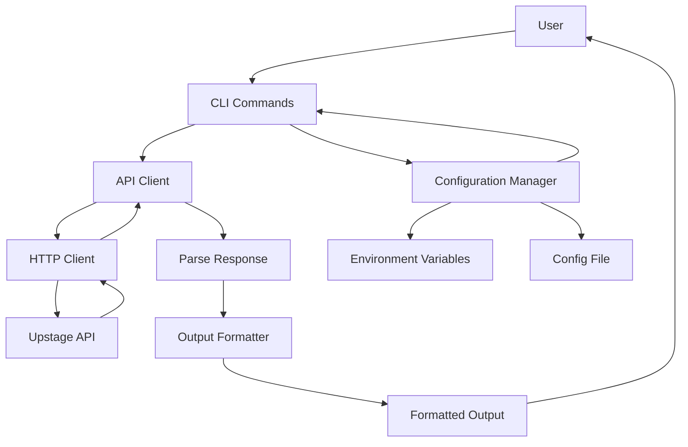
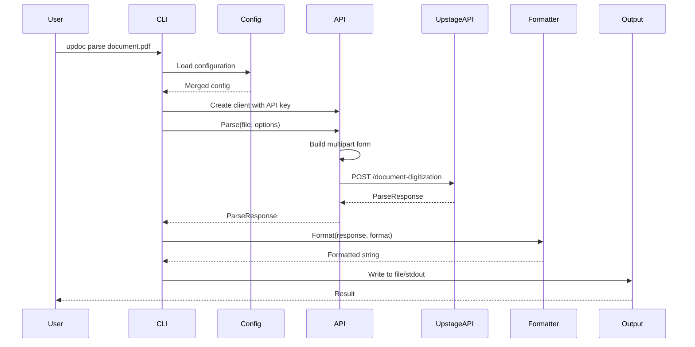
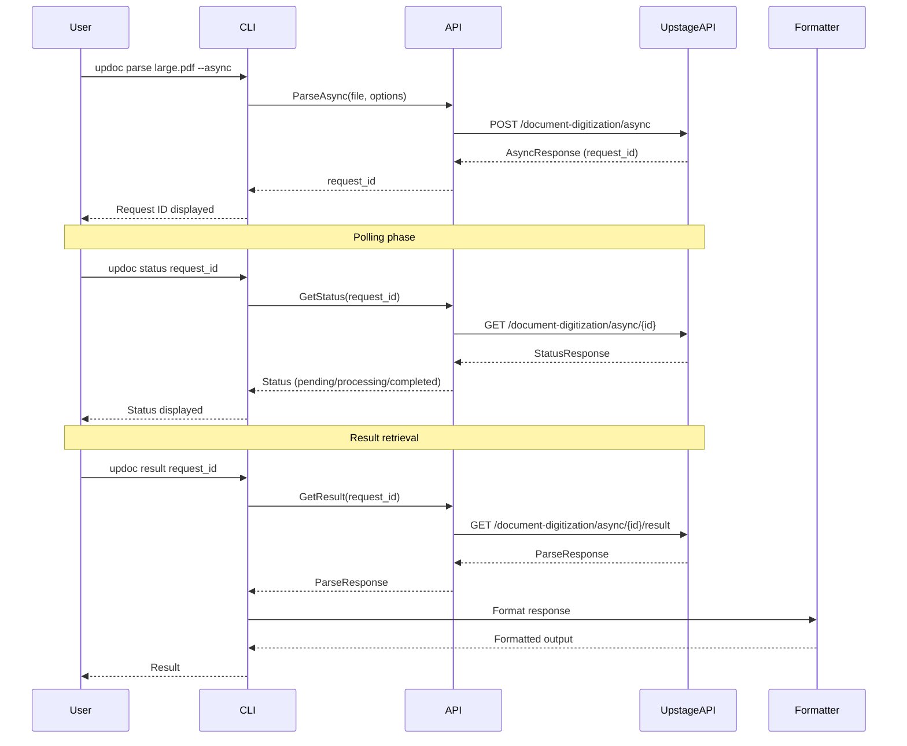
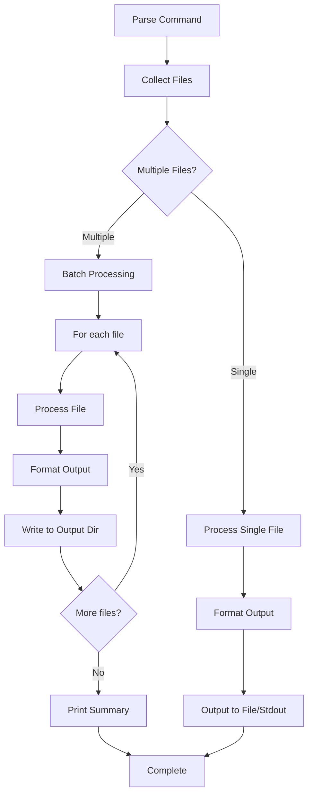
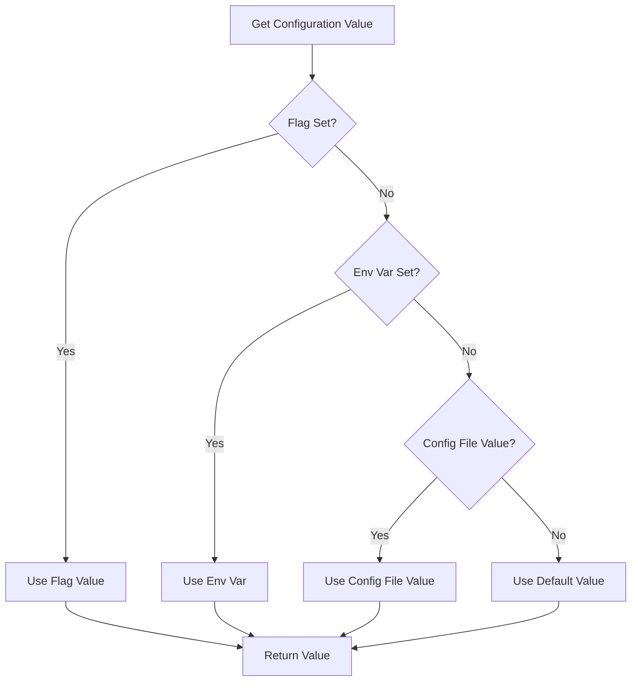
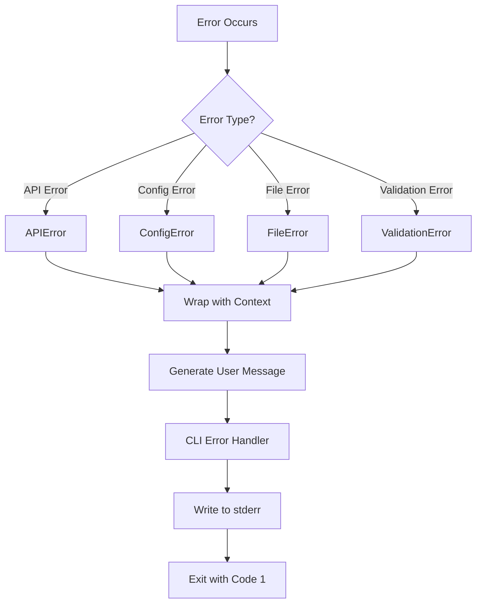

# Architecture Documentation

[한국어](ARCHITECTURE.ko.md) | [日本語](ARCHITECTURE.ja.md)

This document describes the overall architecture, design decisions, and component interactions of the `updoc` CLI tool.

## Table of Contents

- [System Overview](#system-overview)
- [Package Structure](#package-structure)
- [Data Flow](#data-flow)
- [Configuration Hierarchy](#configuration-hierarchy)
- [Error Handling Strategy](#error-handling-strategy)
- [Extension Points](#extension-points)

## System Overview

`updoc` is a command-line interface for the Upstage Document Parse API. It provides a simple way to convert documents (PDF, Office files, images) into structured text formats (HTML, Markdown, Text) through both synchronous and asynchronous API calls.

### High-Level Architecture



### Component Responsibilities

| Component | Responsibility |
|-----------|---------------|
| **CLI Commands** (`internal/cmd`) | Parse user input, validate arguments, orchestrate workflow |
| **API Client** (`internal/api`) | Handle HTTP communication with Upstage API, manage request/response lifecycle |
| **Configuration Manager** (`internal/config`) | Load and merge configuration from multiple sources (env vars, config file, CLI flags) |
| **Output Formatter** (`internal/output`) | Transform API responses into user-requested formats (HTML, Markdown, Text, JSON) |
| **Entry Point** (`cmd/updoc`) | Initialize CLI framework and handle application lifecycle |

## Package Structure

```
updoc/
├── cmd/updoc/              # Application entry point
│   └── main.go            # Initializes CLI and handles errors
│
├── internal/
│   ├── api/               # Upstage API client
│   │   ├── client.go      # HTTP client implementation
│   │   └── types.go       # API request/response types
│   │
│   ├── cmd/               # CLI command implementations
│   │   ├── root.go        # Root command and shared utilities
│   │   ├── parse.go       # Parse command (sync/async)
│   │   ├── status.go      # Status check command
│   │   ├── result.go      # Result retrieval command
│   │   ├── config.go      # Configuration management command
│   │   ├── models.go      # Models listing command
│   │   └── version.go     # Version command
│   │
│   ├── config/            # Configuration management
│   │   └── config.go      # Config loading, saving, validation
│   │
│   └── output/            # Output formatting
│       └── formatter.go   # Format converters (HTML, Markdown, Text, JSON)
│
├── test/                  # Test files
│   ├── e2e/              # End-to-end tests
│   └── testdata/         # Test fixtures
│
└── docs/                  # Documentation
    ├── ARCHITECTURE.md   # This file
    └── CLI_MANUAL.md     # CLI reference
```

### Package Details

#### `cmd/updoc`
- **Purpose**: Application entry point
- **Responsibilities**: Initialize Cobra CLI framework, handle top-level errors
- **Dependencies**: `internal/cmd`

#### `internal/api`
- **Purpose**: Upstage API client abstraction
- **Responsibilities**:
  - Build HTTP requests (multipart form data for file uploads)
  - Handle API authentication (Bearer token)
  - Parse API responses and errors
  - Support both sync and async operations
- **Key Types**: `Client`, `ParseRequest`, `ParseResponse`, `AsyncResponse`, `StatusResponse`

#### `internal/cmd`
- **Purpose**: CLI command implementations
- **Responsibilities**:
  - Define command structure and flags
  - Validate user input
  - Coordinate between API client, config, and output formatters
  - Handle batch processing
  - Manage async workflow (parse → status → result)
- **Key Commands**: `parse`, `status`, `result`, `config`, `models`, `version`

#### `internal/config`
- **Purpose**: Configuration management
- **Responsibilities**:
  - Load configuration from YAML file
  - Merge configuration from environment variables
  - Provide configuration hierarchy resolution
  - Validate configuration values
  - Save configuration to file
- **Key Types**: `Config`

#### `internal/output`
- **Purpose**: Output formatting
- **Responsibilities**:
  - Convert API responses to requested formats
  - Support multiple output formats (HTML, Markdown, Text, JSON)
  - Handle elements-only output mode
- **Key Types**: `Formatter` interface, `HTMLFormatter`, `MarkdownFormatter`, `TextFormatter`, `JSONFormatter`

## Data Flow

### Synchronous Request Lifecycle



### Asynchronous Request Lifecycle



### Batch Processing Flow



## Configuration Hierarchy

Configuration values are resolved in the following order (highest to lowest priority):

1. **Command-line flags** - Direct user input
2. **Environment variables** - System-level configuration
3. **Config file** - User-specific defaults
4. **Default values** - Built-in defaults

### Configuration Resolution Flow



### Configuration Sources

#### Environment Variables
- `UPSTAGE_API_KEY` - API authentication key
- `UPSTAGE_API_ENDPOINT` - Custom API endpoint (for private hosting)
- `UPDOC_CONFIG_PATH` - Override default config file path
- `UPDOC_LOG_LEVEL` - Logging level

#### Config File (`~/.config/updoc/config.yaml` on Linux/macOS, `%APPDATA%\updoc\config.yaml` on Windows)
```yaml
api_key: "up_xxxxxxxxxxxx"
endpoint: "https://api.upstage.ai/v1"
default_format: "markdown"
default_mode: "standard"
default_ocr: "auto"
output_dir: ""
```

#### Command-Line Flags
- `--api-key` - Override API key
- `--endpoint` - Override API endpoint
- `--format` - Override output format
- `--mode` - Override parsing mode
- `--ocr` - Override OCR setting

#### Default Values
- Format: `markdown`
- Mode: `standard`
- OCR: `auto`
- Endpoint: `https://api.upstage.ai/v1`

## Error Handling Strategy

### Error Types

#### 1. API Errors (`internal/api`)
- **Type**: `APIError`
- **Properties**: StatusCode, Message, Type, Code
- **Handling**: Wrapped with context and returned to caller
- **User Message**: Clear error message with status code

```go
type APIError struct {
    StatusCode int
    Message    string
    Type       string
    Code       string
}
```

#### 2. Configuration Errors (`internal/config`)
- **Type**: `ErrUnknownKey`, `ErrInvalidFormat`, `ErrInvalidMode`, `ErrInvalidOCR`
- **Handling**: Returned immediately with descriptive error message
- **User Message**: Specific validation error

#### 3. File System Errors (`internal/cmd`)
- **Type**: Standard Go errors (`os.PathError`, `os.ErrNotExist`)
- **Handling**: Wrapped with context about operation
- **User Message**: File path and operation context

#### 4. Validation Errors (`internal/cmd`)
- **Type**: Custom error messages
- **Handling**: Returned before API calls
- **User Message**: Clear guidance on what's wrong and how to fix

### Error Handling Patterns

#### Pattern 1: Early Validation
```go
// Validate before processing
if apiKey == "" {
    return fmt.Errorf("API key not set. Set it with 'updoc config set api-key <your-key>'")
}
```

#### Pattern 2: Error Wrapping
```go
// Wrap errors with context
if err != nil {
    return fmt.Errorf("parse failed: %w", err)
}
```

#### Pattern 3: User-Friendly Messages
```go
// Convert technical errors to user-friendly messages
if apiErr, ok := err.(*api.APIError); ok {
    return fmt.Errorf("API error: %s", apiErr.Message)
}
```

### Error Flow



## Extension Points

### Adding New Output Formats

To add a new output format:

1. **Implement the `Formatter` interface** in `internal/output/formatter.go`:
```go
type CustomFormatter struct{}

func (f *CustomFormatter) Format(resp *api.ParseResponse) (string, error) {
    // Convert resp to custom format
    return formattedString, nil
}
```

2. **Register in `NewFormatter` function**:
```go
func NewFormatter(format string) (Formatter, error) {
    switch format {
    // ... existing cases
    case "custom":
        return &CustomFormatter{}, nil
    }
}
```

3. **Add format validation** in `internal/config/config.go`:
```go
ValidFormats = []string{"html", "markdown", "text", "custom"}
```

4. **Update CLI help text** in `internal/cmd/parse.go`:
```go
parseCmd.Flags().StringP("format", "f", "", "output format: html, markdown, text, custom")
```

### Adding New Commands

To add a new command:

1. **Create command file** in `internal/cmd/`:
```go
package cmd

import "github.com/spf13/cobra"

var newCmd = &cobra.Command{
    Use:   "new <args>",
    Short: "Command description",
    Long:  "Detailed description",
    RunE:  runNew,
}

func init() {
    newCmd.Flags().StringP("flag", "f", "", "flag description")
    rootCmd.AddCommand(newCmd)
}

func runNew(cmd *cobra.Command, args []string) error {
    // Command implementation
    return nil
}
```

2. **Register command** in `init()` function of the new file

3. **Update documentation**:
   - Add to `docs/CLI_MANUAL.md`
   - Update `README.md` command summary

### Adding New Configuration Options

To add a new configuration option:

1. **Add field to `Config` struct** in `internal/config/config.go`:
```go
type Config struct {
    // ... existing fields
    NewOption string `yaml:"new_option"`
}
```

2. **Add default value**:
```go
const DefaultNewOption = "default_value"
```

3. **Update `Set` and `Get` methods**:
```go
func (c *Config) Set(key, value string) error {
    switch key {
    // ... existing cases
    case "new-option":
        c.NewOption = value
    }
}

func (c *Config) Get(key string) (string, error) {
    switch key {
    // ... existing cases
    case "new-option":
        return c.NewOption, nil
    }
}
```

4. **Update `New` and `Reset` methods** to include the new field

5. **Add CLI flag** if needed in `internal/cmd/root.go` or command-specific files

6. **Update documentation** in `docs/CLI_MANUAL.md`

### Extending API Client

To add new API endpoints:

1. **Add request/response types** in `internal/api/types.go`:
```go
type NewRequest struct {
    // Request fields
}

type NewResponse struct {
    // Response fields
}
```

2. **Add client method** in `internal/api/client.go`:
```go
func (c *Client) NewOperation(ctx context.Context, req *NewRequest) (*NewResponse, error) {
    // Build request
    // Send HTTP request
    // Parse response
    // Return result
}
```

3. **Use in commands** as needed

## Design Decisions

### Why Cobra for CLI?
- Industry standard for Go CLI applications
- Excellent flag parsing and validation
- Built-in help generation
- Easy command composition

### Why Separate API Client Package?
- Separation of concerns
- Easier testing (can mock API client)
- Reusability if API client is needed elsewhere
- Clear API boundary

### Why Configuration Hierarchy?
- Flexibility: users can override defaults at different levels
- Security: sensitive values (API keys) can come from environment variables
- Convenience: common settings can be saved in config file
- Predictability: clear precedence rules

### Why Formatter Interface?
- Easy to add new output formats
- Testable (can test formatters independently)
- Follows Open/Closed Principle
- Clear separation between API response and output format

## Testing Strategy

### Unit Tests
- Each package has corresponding `*_test.go` files
- Test individual components in isolation
- Mock external dependencies (HTTP client, file system)

### Integration Tests
- Test component interactions
- Use test fixtures from `test/testdata/`

### End-to-End Tests
- Located in `test/e2e/`
- Require valid API key
- Test full workflow from CLI to API

## Future Considerations

- **Plugin System**: Allow external formatters via plugins
- **Streaming Output**: Support streaming for large documents
- **Retry Logic**: Automatic retry for transient API errors
- **Rate Limiting**: Client-side rate limiting for API calls
- **Caching**: Cache API responses for repeated requests
- **Progress Indicators**: Better progress reporting for batch operations
